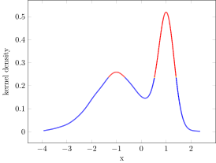

# HighestDensityRegions


[](https://travis-ci.org/tpapp/HighestDensityRegions.jl)
[](https://coveralls.io/github/tpapp/HighestDensityRegions.jl?branch=master)
[](http://codecov.io/github/tpapp/HighestDensityRegions.jl?branch=master)

Julia library for calculating Highest Density Regions.

## Installation

```julia
pkg> add HighestDensityRegions
```

## Usage

The single exported function is `hdr_thresholds`, which returns a vector thresholds for the given probabilities.

## Examples

### 1D HPD coloring

[This example code](examples/1d-density.jl) was used to produce



### 2D HPD regions

[This example code](examples/2d-density.jl) was used to produce


## Bibliography

- Hyndman, R. J. (1996). Computing and graphing highest density regions. The American Statistician, 50(2), 120–126.
